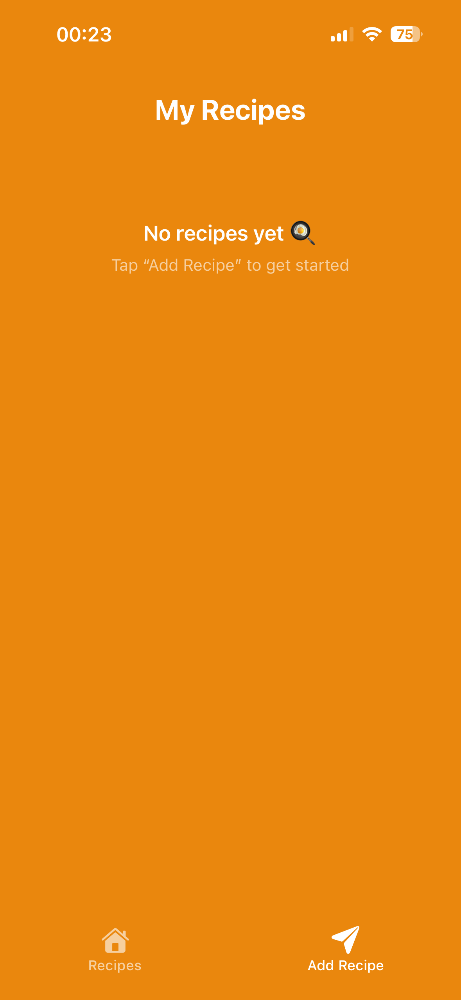
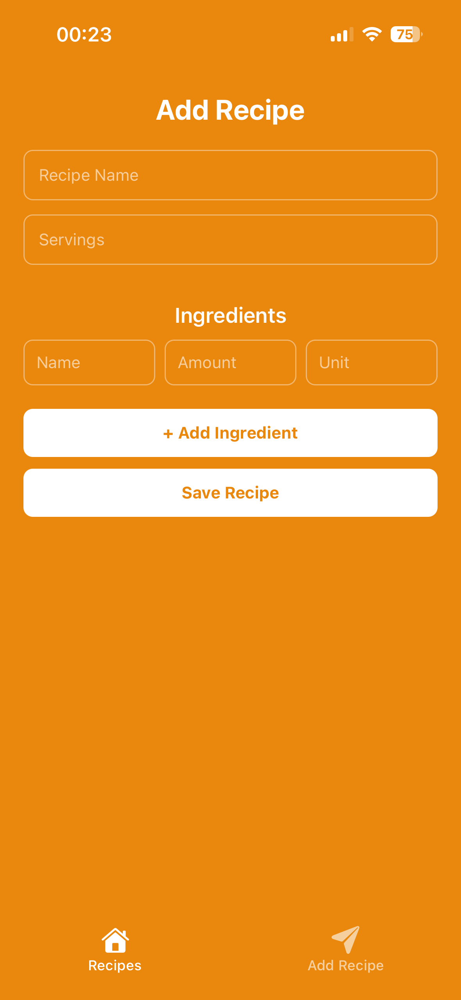
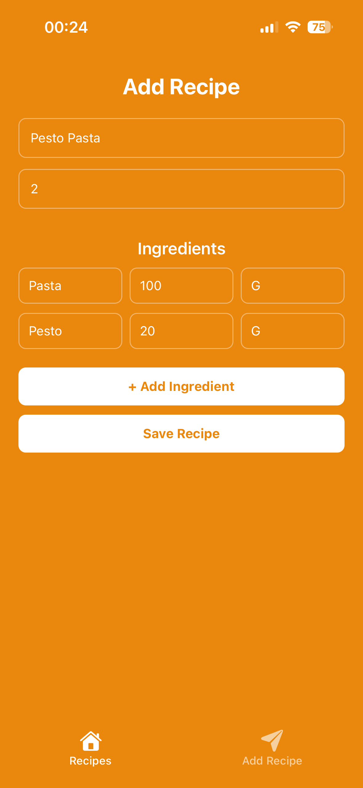
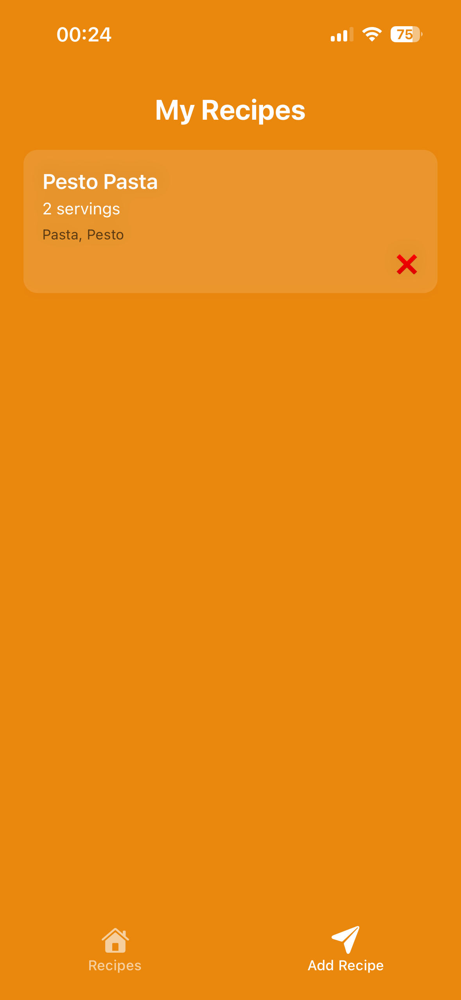

# Recipe Scale App

A mobile recipe scaling app built with React Native and Expo Router that allows users to create recipes and dynamically adjust ingredient quantities based on serving size.

## Screenshots







## Features

- Add custom recipes
- Dynamic serving size scaling
- Persistent local storage with AsyncStorage
- Mobile-first responsive UI
- Type-safe navigation with Expo Router

## Tech Stack

- React Native
- Expo
- Expo Router
- TypeScript
- AsyncStorage
- Context API

## Installation

```bash
npm install
npx expo start
```

## What I Learned

- Managing application state with Context API
- Persisting data with AsyncStorage
- Structuring routes using Expo Router
- Handling async loading and navigation edge cases
- Building responsive mobile UI layouts

## Challenges

One challenge was ensuring newly created recipes were immediately available after navigation without requiring a refresh. This was solved by improving async state handling and conditional loading logic.
